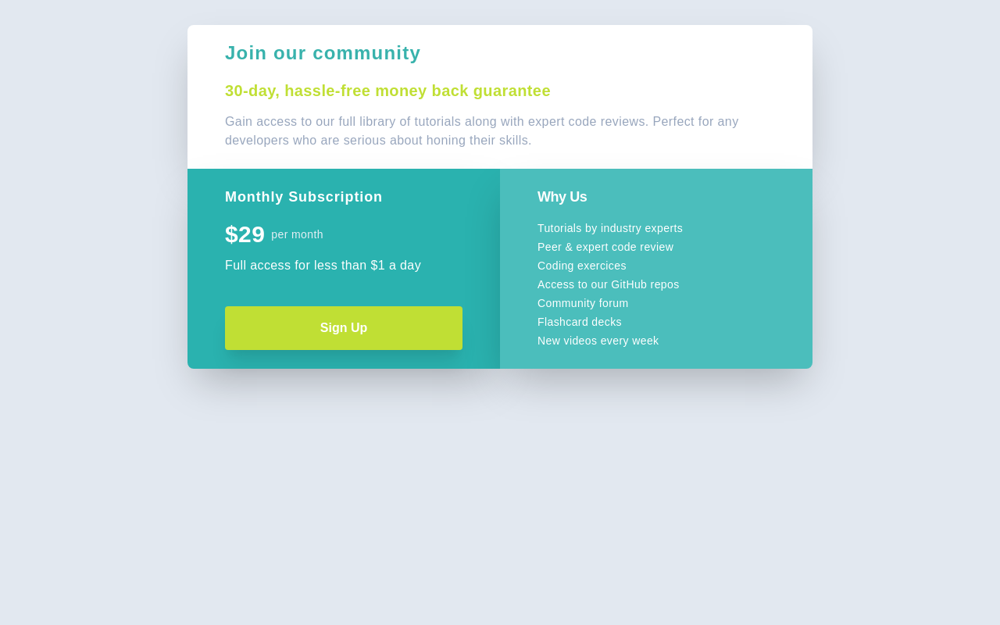
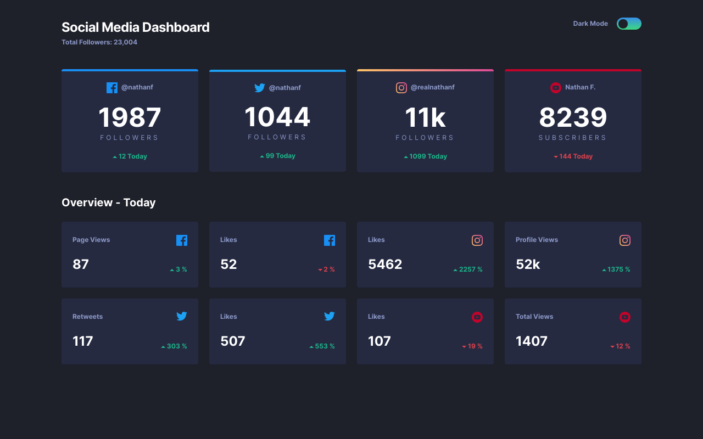

Here's a collection of solutions to FrontendMentor.io challanges.

This is part of a deliberate practice experiment to improve and expand my frontend skills. I wrote more about it in my [Wax on, Wax off](https://www.robincussol.com/wax-on-wax-off/) post if you are interested.

1. Single Price Grid component: [🗄Files](./single-price-grid-component) | [🚀Deployment](https://single-price-grid-component-frontendmentor.vercel.app/)
   

2. Social Media Dashboard with Theme Switcher: [🗄Files](./social-media-dashboard-with-theme-switcher) | [🚀Deployment](https://social-media-dashboard-with-theme-switcher-frontendmentor.vercel.app/)
   
